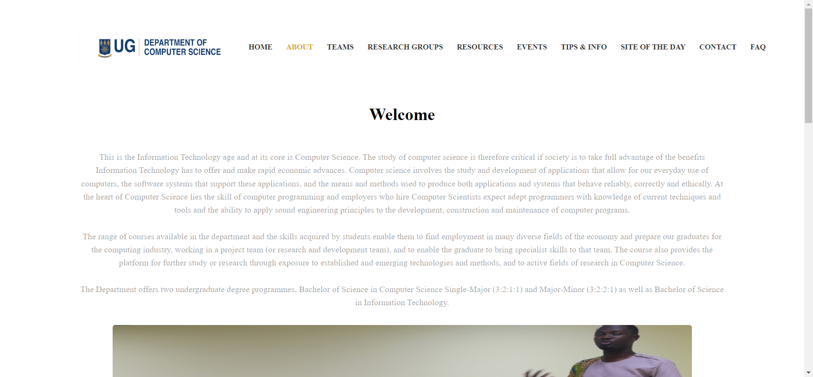

<div align="center" id="top"> 
  

&#xa0;

  <!-- <a href="https://csdepartmentwebsite.netlify.app">Demo</a> -->
</div>

<h1 align="center">Cs Department Website</h1>

<p align="center">
  

  

  

  

</p>

<!-- Status -->

<!-- <h4 align="center">
	🚧  Cs Department Website 🚀 Under construction...  🚧
</h4>

<hr> -->

<p align="center">
  <a href="#dart-about">About</a> &#xa0; | &#xa0; 
  <a href="#sparkles-features">Features</a> &#xa0; | &#xa0;
  <a href="#rocket-technologies">Technologies</a> &#xa0; | &#xa0;
  <a href="#white_check_mark-requirements">Requirements</a> &#xa0; | &#xa0;
  <a href="#checkered_flag-starting">Starting</a> &#xa0; | &#xa0;
  <a href="#memo-license">License</a> &#xa0; | &#xa0;
  <a href="https://github.com/{{YOUR_GITHUB_USERNAME}}" target="_blank">Justice Darko  11115009</a>
</p>

<br>

## :dart: About

Describe your project

This computer science website serves as a centralized digital hub for enthusiasts interested in the dynamic field of computer science. Functioning as an online platform, it offers a wealth of resources, information, and community engagement across various facets of computer science.

The primary objectives of this computer science website are as follows:

1. **Educate and Inform:** Deliver informative content, articles, tutorials, and resources to ensure visitors stay abreast of the latest developments, programming languages, algorithms, and technologies in the field of computer science.

2. **Facilitate Learning:** Provide a range of courses, programs, and learning materials tailored to both beginners and experienced individuals, supporting them in expanding their knowledge and honing their skills in computer science.

3. **Event and Conference Information:** Keep the audience updated on upcoming events, conferences, workshops, and seminars relevant to computer science. This facilitates opportunities for networking and knowledge exchange within the community.

4. **Alumni Engagement:** Showcase profiles and achievements of alumni, fostering a sense of continuity and highlighting success stories of individuals who have graduated from the computer science program.

5. **News and Updates:** Deliver timely news and updates on breakthroughs, advancements, and notable events in the realm of computer science. This ensures that the audience stays well-informed about the rapidly evolving landscape of the field.



## :sparkles: Features

:heavy_check_mark: Feature 1;\
:heavy_check_mark: Feature 2;\
:heavy_check_mark: Feature 3;

## :rocket: Technologies

The following tools were used in this project:

- [Node.js](https://nodejs.org/en/)
- [React](https://pt-br.reactjs.org/)
- [TypeScript](https://www.typescriptlang.org/)

## :white_check_mark: Requirements

Before starting :checkered_flag:, you need to have [Git](https://git-scm.com) and [Node](https://nodejs.org/en/) installed.

## :checkered_flag: Starting

```bash
# Clone this project
$ git clone https://github.com/darkojustice/cs-department-website

# Access
$ cd cs-department-website

# Install dependencies
$ yarn

# Run the project
$ yarn start

# The server will initialize in the <http://localhost:3000>
```

## :memo: License

This project is under license from MIT. For more details, see the [LICENSE](LICENSE.md) file.

Made with :heart: by <a href="https://github.com/{{YOUR_GITHUB_USERNAME}}" target="_blank">Develop_with_justIce</a>

&#xa0;

<a href="#top">Back to top</a>
